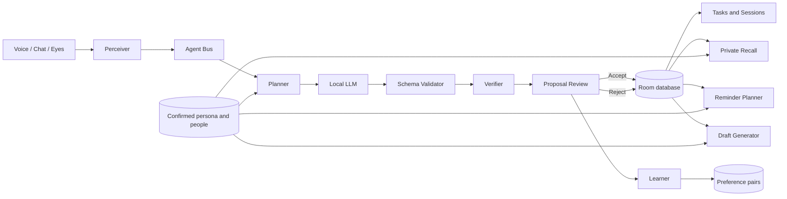

# ERAYA

> A privacy-first, adaptive personal digital twin that remembers commitments with evidence, learns only from confirmed signals, and runs on the owner's phone.

**ERAYA does not act silently. Agents propose; humans commit.**

ERAYA combines local speech recognition, a local language model, deterministic verification, private memory, an animated anime portrait, personal recall, OCR, reminders, and signed two-phone commitments in one Android application. It is designed for situations where personal conversations, promises, preferences, and identity data should not be uploaded to a cloud assistant.

The current reference build is **ERAYA 0.18.1** for Android 11+ on `arm64-v8a`. The verified baseline uses `whisper.cpp` and `llama.cpp` inside Termux over loopback-only connections. NPU interfaces exist, but the NPU implementations are not yet integrated and must not be presented as complete.

## Contents

- [The problem](#the-problem)
- [The idea](#the-idea)
- [What makes ERAYA different](#what-makes-eraya-different)
- [Feature status](#feature-status)
- [User experience](#user-experience)
- [End-to-end flows](#end-to-end-flows)
- [Architecture](#architecture)
- [Privacy and trust model](#privacy-and-trust-model)
- [Data stored on the phone](#data-stored-on-the-phone)
- [Technology stack](#technology-stack)
- [Install and run on an iQOO phone](#install-and-run-on-an-iqoo-phone)
- [Build on a Windows laptop](#build-on-a-windows-laptop)
- [Five-minute demo](#five-minute-demo)
- [Testing and verification](#testing-and-verification)
- [Troubleshooting](#troubleshooting)
- [Repository map](#repository-map)
- [Known limitations and roadmap](#known-limitations-and-roadmap)
- [Hackathon disclosure](#hackathon-disclosure)

## The problem

People make important commitments across voice conversations, messages, handwritten notes, and everyday interactions:

- “I will send the report by Friday.”
- “Remind me to call Alex tomorrow.”
- “I usually need two full days for this kind of document.”
- “Draft messages to my manager formally, but keep messages to close friends casual.”

Most assistants either forget the context, upload sensitive data to a remote service, or act without giving the owner a clear review boundary. A personal digital twin needs a different trust model. It must remember with evidence, separate a suggestion from a decision, explain what it used, and keep the owner in control.

ERAYA is not primarily a meeting recorder. It is a private model of the owner's commitments, communication style, routines, preferences, and trusted relationships.

## The idea

ERAYA turns speech, typed text, or a photographed note into proposed commitments. Every proposal must preserve supporting evidence from the original input. Nothing becomes an accepted task until the owner confirms it.

Over time, ERAYA can build a guarded persona from a behaviour interview and explicit edits. That persona helps it:

- recognize the owner's preferred tone and communication style;
- flag deadlines that are unusually tight for the owner;
- draft different replies for different people;
- schedule reminders around quiet hours and weekend preferences;
- recall previous commitments with tappable local evidence;
- animate a private anime portrait during voice or chat interaction.

## What makes ERAYA different

### 1. Offline-first inference

The working baseline runs speech recognition and language generation on the phone. The Android app only permits HTTP requests to `127.0.0.1` or `localhost`, where the Termux inference servers run.

### 2. Evidence before memory

A model output is not trusted simply because it is valid JSON. The verifier checks that every proposed commitment contains evidence found in the transcript. Unsupported proposals are rejected before they reach the review screen.

### 3. Proposal before action

ERAYA maintains a hard distinction between:

- **proposed** — created by an agent and awaiting the owner;
- **accepted** — explicitly confirmed by the owner;
- **rejected** — explicitly declined by the owner.

Calendar actions, reminders, drafts, and recall operate from this visible decision boundary.

### 4. Adaptive, but consent-driven

The digital twin does not silently infer sensitive identity traits. Interview-derived traits require evidence and a separate confirm/edit/reject step. Medical, mental-health, religious, caste, political, financial, and personality-type inferences are blocked by code.

### 5. A personal presence, not a 3D gimmick

The Room uses a portrait-only anime representation. It supports breathing, gaze, blinking, small head motion, and audio-driven mouth movement. The app does not claim photorealistic 3D reconstruction.

### 6. Shared commitments can be signed

Two ERAYA phones can exchange a public commitment through QR codes. Each phone signs the canonical payload using a device-bound P-256 key. A hash-chained local ledger exposes later tampering.

## Feature status

The distinction between implementation and real-device proof is deliberate. See [the product completion audit](docs/PRODUCT_COMPLETION_AUDIT.md) for the detailed evidence gate.

| ID | Capability | Current state | Honest boundary |
|---|---|---|---|
| F1 | Foreground audio capture | Implemented | Real microphone permission is required |
| F2 | Chunked transcription | Implemented with `whisper.cpp` CPU fallback | Termux server must be running |
| F3 | Commitment extraction | Implemented with schema-constrained `llama.cpp` output | Quality depends on the selected local model |
| F4 | Evidence verification | Implemented deterministically | Evidence is lexical, not semantic |
| F5 | Human confirmation | Implemented | Only accepted proposals become active tasks |
| F6 | Session and task history | Implemented with Room | Hackathon schema changes may reset test data |
| F7 | Calendar hand-off | Implemented with Android calendar intent | The user completes the final calendar save |
| F8 | Engine and language settings | Implemented | NPU selections are not usable yet |
| F9 | English and Hindi/Hinglish handling | Implemented in prompts, deadlines, and OCR | Requires final live Hindi rehearsal |
| F10 | Signed two-phone handshake | Core implemented | Full two-phone stage proof is still required |
| F11 | Eyes: note/whiteboard OCR | Core implemented | Live CameraX framing and evidence crops are future work |
| F12 | Owner speaker attribution | Missing | No speaker embedding is integrated; speaker can remain unknown |
| F13 | People-aware extraction and deadline risk | Implemented | Real owner attribution still depends on F12 |
| F14 | Persona-aware follow-up drafts | Implemented | Sharing remains an explicit Android share-sheet action |
| F15 | Preference learning and JSONL export | Implemented | No background training occurs in the app |
| F16 | Voice enrolment | Partial | Consent, reference clips, rate, and pitch exist; this is not voice cloning |
| F17 | Behaviour interview and Trait Review | Core implemented | Full restart/resume phone walkthrough is still required |
| F18 | Private commitment recall | Core implemented | Current retrieval is lexical plus recency, without embeddings |
| F19 | Personal reminders | Implemented with WorkManager and labelled system TTS | Reminders do not use a cloned owner voice |

## User experience

ERAYA uses four independent Navigation 3 stacks so each main area keeps its own history.

### Room

The main interaction surface contains the animated private portrait and two modes:

- **Voice** — record a request or conversation, transcribe locally, and receive a spoken response;
- **Chat** — type directly to the local model;
- **Make tasks** — send selected conversation text into the guarded commitment pipeline;
- **Recall cards** — inspect the exact accepted or rejected records behind a memory answer.

If the portrait is not configured, the Room provides a direct path to Portrait Studio.

### Sessions

Sessions preserve the source interaction and its extracted commitments. A session detail view shows the evidence, people, deadlines, confidence, and decision state connected to that capture.

### Tasks

Tasks shows accepted commitments. A task detail view can:

- display the exact evidence;
- show who made the promise and to whom;
- show a deterministic “Tight for you” risk explanation;
- open the Android calendar;
- create a persona-aware follow-up draft;
- expose reminder information.

### You

The personal twin area contains:

- **My profile** — confirmed persona traits and their evidence;
- **People** — local person cards, aliases, relationship, register, channel, and trust tier;
- **Portrait Studio** — guided portrait capture or validated portrait-package import;
- **My voice** — consent recording and private voice-reference collection;
- **Eyes** — offline English and Devanagari OCR for notes and whiteboards;
- **Trust handshake** — signed QR offer, countersign, ledger, and tamper demonstration;
- **Get to know me** — full or demo behaviour interview;
- **Privacy and export** — preference export and Delete my twin.

### Settings

Settings exposes engine status, language hints, reminder behaviour, model-directory information, sample/demo tools, battery guidance, and application information.

## End-to-end flows

### Spoken commitment flow

1. The microphone captures 16 kHz mono PCM in a foreground service.
2. Audio is split into bounded chunks.
3. `whisper.cpp` transcribes each chunk locally.
4. The Perceiver publishes transcript events to the agent bus.
5. The Planner asks the local LLM for schema-constrained commitment JSON.
6. The Verifier checks schema, confidence, dates, people IDs, and verbatim evidence.
7. Valid items appear as proposals.
8. The owner accepts or rejects each proposal.
9. Accepted tasks become available to reminders, calendar hand-off, drafts, and recall.

### Typed commitment flow

Typed text enters the same extraction, verification, and confirmation path. It is useful when microphone access is unavailable or when demonstrating without live audio.

### Eyes flow

1. The camera writes one image through ERAYA's private `FileProvider` path.
2. The bundled ML Kit Devanagari recognizer reads Latin and Devanagari text on the device.
3. Deterministic cleanup removes blank and adjacent duplicate lines.
4. The owner edits the recognized text.
5. **Propose commitments** sends only the reviewed text into the normal guarded pipeline.
6. The source image is deleted immediately after consumption or explicit discard.

### Behaviour interview flow

1. ERAYA asks a spoken or written question from the local question bank.
2. The owner answers by voice or text.
3. A short answer can trigger at most one follow-up question.
4. Section answers are summarized into evidence-backed trait proposals.
5. TraitFilter removes unsupported or blocked categories.
6. The owner confirms, edits, or rejects every proposed trait.
7. Only confirmed traits enter `persona.json`.

The interview is checkpointed in private storage. Stopping pauses it; reopening offers **Resume interview** or **Start over**. Interrupted recording and transcription states recover to an editable, safe state.

### Recall flow

A query such as **“What did I promise Alex?”** is routed to deterministic local retrieval when it resembles a commitment-memory request. Retrieval:

- searches only the owner's accepted and rejected commitment records;
- scores person, task, deadline, and evidence matches;
- adds a bounded recency preference;
- removes duplicate records;
- returns commitment IDs and tappable evidence cards.

Ordinary conversation continues through the selected local LLM.

### Trust handshake flow

1. The owner chooses an accepted commitment and creates an offer.
2. Android Keystore creates or loads a device-bound P-256 signing key.
3. ERAYA signs a canonical public payload and displays it as a QR code.
4. A second ERAYA phone scans and verifies the owner signature offline.
5. The second owner reviews and countersigns the same commitment.
6. The first phone scans the return QR and verifies that it belongs to its offer.
7. Both devices append the result to their local hash-chained ledgers.

The QR intentionally excludes persona data, evidence, voice recordings, and private relationship metadata.

### Portrait and conversation flow

Portrait Studio accepts guided private captures or a validated laptop-generated anime portrait package. The Room renders only the portrait assets, then applies:

- slow breathing scale;
- head sway and small nods;
- randomized gaze changes;
- eye-region blink frames;
- a talking frame when supplied;
- lower-face deformation driven by speech amplitude.

This is an animated 2D portrait experience. The earlier 3D viewer is not part of the product surface.

### Voice enrolment flow

Voice enrolment records explicit spoken consent, checks the consent words through local ASR, and collects aligned reference audio and transcripts. It calculates speaking rate and a lightweight pitch estimate to tune Android system TTS.

The current build does **not** perform same-speaker biometric verification and does **not** synthesize a cloned owner voice. Spoken output remains clearly labelled **AI voice**.

## Architecture



### Agent responsibilities

| Component | Responsibility |
|---|---|
| Perceiver | Converts ASR output into transcript events |
| Planner | Calls the local LLM and extraction agent |
| Verifier | Rejects malformed, unsupported, or unevidenced commitments |
| ConfirmationLoop | Applies explicit accept, reject, and undo decisions |
| TwinAgent | Produces owner-facing interpretations without changing decision state |
| Learner | Stores proposal, draft, and trait preference pairs |
| Recoverer | Handles retryable pipeline failures |

### Engine boundary

```text
Android app
  ├─ ASR interface
  │    ├─ FALLBACK: whisper.cpp at 127.0.0.1:8082
  │    └─ NPU: WhisperKit placeholder, currently unsupported
  └─ LLM interface
       ├─ FALLBACK: llama.cpp at 127.0.0.1:8081
       └─ NPU: GenieX placeholder, currently unsupported
```

Engine health is loaded at startup and can be retried from Settings after Termux is started. Switching tiers does not require an Android app restart, but selecting an unfinished NPU tier returns an explicit unsupported error.

## Privacy and trust model

### Network boundary

- The only Android HTTP client allows `127.0.0.1` and `localhost`.
- It uses `Proxy.NO_PROXY` so requests cannot be redirected through a system proxy.
- The app contains no cloud inference API, analytics SDK, crash reporter, or advertising SDK.
- Internet permission exists only to reach the loopback Termux servers.
- Model and dependency downloads happen during setup, before an airplane-mode demonstration.

### Storage boundary

- Android backup and data extraction are disabled.
- Persona, people, interview drafts, portrait assets, handshake records, OCR captures, and voice references use app-private storage.
- Structured sessions, commitments, and preference pairs use a private Room database.
- Eyes deletes the source photograph after the reviewed text is submitted.
- Voice references are not included in preference exports.

### Human decision boundary

- An LLM response is a proposal, never an automatic commitment.
- Every saved commitment has an explicit owner decision.
- Calendar creation ends at the Android calendar confirmation screen.
- Draft sharing ends at the Android share sheet.
- Trait proposals require confirm, edit, or reject.
- Signed commitments require both devices to review and sign.

### Prompt and data guardrails

- Extracted evidence must occur in the source transcript.
- People identifiers must match the local people list.
- Hypothetical or quoted promises are filtered from owner commitments.
- Conversation context is separated from action requests.
- Generated text is prevented from falsely claiming that an external action was completed.
- Sensitive trait categories are blocked from interview-derived persona updates.

### Delete my twin

The privacy screen can remove:

- persona and people files;
- interview checkpoints;
- voice consent, clips, transcripts, and profile;
- portrait and replica assets;
- Eyes captures;
- handshake identity and ledger;
- learned preference pairs.

The completion audit still requires a final device-level inspection proving every internal file and database row is absent after deletion.

## Data stored on the phone

| Data | Location | Purpose | Exported automatically? |
|---|---|---|---|
| Sessions | Room: `tachyon.db` | Source capture history | No |
| Commitments | Room: `tachyon.db` | Proposed, accepted, and rejected records | No |
| Preference pairs | Room: `tachyon.db` | Explicit learning signals | Only after owner export |
| Persona | `files/twin/persona.json` | Confirmed owner traits | No |
| People | `files/twin/people.json` | Local relationship and register cards | No |
| Interview draft | `files/twin/interview_draft.json` | Resume unfinished interview | No |
| Voice profile | `files/twin/voice/` | Consent and reference recordings | No |
| Portrait package | Private replica directory | Room portrait and expression frames | No |
| Handshake ledger | `files/twin/handshake_ledger.jsonl` | Signed shared commitments | No |
| Eyes image | `files/eyes/` | Temporary OCR source | No; deleted after use |

## Technology stack

### Android application

- Kotlin 2.4
- Jetpack Compose and Material 3
- AndroidX Navigation 3 with independent tab stacks
- Coroutines, `StateFlow`, and a process-level manual dependency container
- Room database with KSP code generation
- WorkManager for deadline reminders
- Android Keystore for device-bound handshake signing
- Android system TTS for clearly labelled AI speech
- Kotlin serialization for local contracts and strict payloads
- OkHttp restricted to loopback hosts

### On-device ML and media

- `whisper.cpp` server for multilingual speech recognition
- `llama.cpp` server for Qwen-family GGUF inference
- ML Kit bundled Devanagari text recognition for Latin and Devanagari OCR
- ML Kit bundled barcode recognition for offline QR scanning
- ML Kit face mesh for guided portrait analysis
- ZXing for QR generation
- Custom PCM, WAV, VAD, portrait motion, and evidence validation logic

### Build targets

| Setting | Value |
|---|---|
| Application ID | `com.evolet.tachyon` |
| Current version | `0.18.1` (`versionCode 20`) |
| Minimum Android | API 30 / Android 11 |
| Target SDK | 35 |
| Compile SDK | 37 |
| ABI | `arm64-v8a` |
| Java | JDK 17 |
| Release optimization | R8 shrinking and resource shrinking |
| Current release signing | Debug key for hackathon sideloading, not production distribution |

## Install and run on an iQOO phone

For the full OriginOS checklist, follow [PHONE_SETUP.md](PHONE_SETUP.md). The essential path is below.

### Prerequisites

- An Android 11+ `arm64-v8a` phone; the reference device is iQOO 15.
- At least 5 GB of free storage for build tools, source, models, and temporary files.
- Termux and Termux:API from their official GitHub or F-Droid releases.
- USB debugging if installing from a laptop.
- Wi-Fi for initial packages and model downloads.

Do not install the obsolete Play Store build of Termux.

### 1. Prepare Termux

```bash
pkg install -y git
git clone https://github.com/martian3062/ErayaXiqoo.git
bash ErayaXiqoo/termux/setup.sh
```

The setup script installs the required packages and builds `llama-server` and `whisper-server` from source.

### 2. Download the reference models

```bash
mkdir -p ~/models
cd ~/models

wget -O ggml-base-q5_1.bin \
  https://huggingface.co/ggerganov/whisper.cpp/resolve/main/ggml-base-q5_1.bin

wget -O qwen3.5-2b-q4_0.gguf \
  https://huggingface.co/unsloth/Qwen3.5-2B-GGUF/resolve/main/Qwen3.5-2B-Q4_0.gguf
```

The default CPU configuration uses a quantized 2B language model. Larger models may fit in memory but are not the tested latency baseline.

### 3. Start both local servers

```bash
bash ~/ErayaXiqoo/termux/run_servers.sh
```

Expected endpoints:

```text
ASR  http://127.0.0.1:8082
LLM  http://127.0.0.1:8081
```

Leave Termux running. The script acquires a Termux wake lock, starts both processes, and waits for them.

### 4. Install the APK

From a Windows laptop:

```powershell
adb devices -l
adb install -r .\dist\ERAYA-0.18.1.apk
adb shell am start -n com.evolet.tachyon/.MainActivity
```

Alternatively, download a successful GitHub Actions APK artifact and open it on the phone. Allow installation from that file source when Android asks.

### 5. Grant permissions

On first launch, allow:

- microphone access;
- notifications on Android 13+.

Camera photos use Android's camera activity and ERAYA's private `FileProvider`; the app does not request broad gallery or shared-storage access.

### 6. Disable aggressive battery restrictions

OriginOS can stop Termux or ERAYA while the screen changes. Set both applications to unrestricted background battery use. In ERAYA, open:

```text
Settings -> Demo tools -> Allow background activity
```

### 7. Verify the engines

Open:

```text
Settings -> Engines
```

Both CPU engines should show ready. If they do not, keep Termux open, confirm that both servers finished loading, and tap **Retry**.

### 8. Enter airplane mode

After packages, models, and the APK are installed:

1. enable airplane mode;
2. reopen Termux if necessary;
3. start the servers;
4. open ERAYA;
5. verify both engines again;
6. run a real voice capture.

The loopback interface continues to work in airplane mode.

## Build on a Windows laptop

### Requirements

- JDK 17
- Android SDK with platform 37 and build tools
- Git
- PowerShell

### Debug build

```powershell
$env:JAVA_HOME = 'C:\path\to\jdk-17'
$env:ANDROID_HOME = 'C:\Users\you\AppData\Local\Android\Sdk'
.\gradlew.bat testDebugUnitTest lintDebug assembleDebug --no-daemon --console=plain
```

Output:

```text
app/build/outputs/apk/debug/app-debug.apk
```

### Shrunk release build

```powershell
.\gradlew.bat clean testDebugUnitTest lintDebug assembleRelease --no-daemon --console=plain
```

Output:

```text
app/build/outputs/apk/release/app-release.apk
```

The current release variant is deliberately debug-signed for hackathon sideloading. Create and protect a dedicated release keystore before any production or store distribution.

### Install and inspect

```powershell
adb install -r app\build\outputs\apk\release\app-release.apk
adb shell dumpsys package com.evolet.tachyon | Select-String 'versionName|versionCode'
adb shell am start -n com.evolet.tachyon/.MainActivity
```

## Five-minute demo

Prepare the phone before going on stage: models loaded, airplane mode enabled, battery restrictions removed, portrait imported, and one sample commitment available.

### Minute 0-1: private presence

1. Open the Room.
2. Show the animated portrait breathing and looking around.
3. Point to the offline and CPU status indicators.
4. Explain that the model servers are bound to the phone's loopback interface.

### Minute 1-2: capture and verify

Say:

> I will send the design report to Alex by Friday evening.

Stop recording and show:

- the transcript;
- the extracted task;
- the exact evidence;
- the deadline;
- the proposed state.

Accept the proposal only after explaining the confirmation boundary.

### Minute 2-3: recall with evidence

Return to the Room and ask:

> What did I promise Alex?

Open the cited source card and show the accepted local commitment.

### Minute 3-4: adaptive twin

Open **You -> Get to know me -> Demo interview**. Answer one short question, show the follow-up rule, then show Trait Review. Confirm one safe trait and reject another. If time is short, demonstrate that Stop creates a resumable private checkpoint.

### Minute 4-5: multimodal trust

Choose one:

- **Eyes:** photograph a written note, edit the OCR text, and propose commitments;
- **Trust handshake:** show a signed offer QR and the tamper-detection screen;
- **Draft:** open an accepted task and compare a formal recipient draft with a casual recipient draft.

Close with:

> ERAYA remembers with evidence, speaks with disclosure, adapts only from confirmed signals, and acts only after a tap.

## Testing and verification

The latest local 0.18.1 validation completed:

- **90 JVM tests**;
- **0 failures**;
- **0 test errors**;
- **0 Android lint errors**;
- **8 lint warnings**;
- clean R8-shrunk release build;
- valid APK Signature Scheme v2 signature using the hackathon debug key.

Run the complete local gate:

```powershell
.\gradlew.bat clean testDebugUnitTest lintDebug assembleRelease --no-daemon --console=plain
```

The test suite covers, among other areas:

- PCM chunk boundaries and WAV encoding;
- deadline parsing;
- schema and evidence validation;
- hypothetical commitment filtering;
- agent bus behaviour and retries;
- reminders, quiet hours, weekends, and tolerance;
- trait filtering, persona merging, and interview draft serialization;
- recall scoring and owner-only filtering;
- signed handshake verification and chain tamper detection;
- OCR text cleanup;
- portrait package validation and motion math;
- consent text similarity and voice profile calculations.

### GitHub Actions

Pushes to `main` run the APK workflow. A successful workflow produces:

- `eraya-debug-apk`;
- `eraya-release-apk`.

The workflow builds both variants and runs JVM unit tests. Local development should also run `lintDebug` before publication.

### Device proof still required

Automated tests do not prove the complete user experience. The final completion gate requires:

- five consecutive real-voice airplane-mode runs;
- one English/Hinglish and one Devanagari Eyes run;
- a two-phone handshake and return QR;
- interview pause, process restart, and resume;
- reminder fire, calendar hand-off, preference export, and Delete my twin inspection;
- a thermal and interruption rehearsal on the target phone.

## Troubleshooting

### `whisper-server not reachable on 127.0.0.1:8082`

1. Open Termux.
2. Confirm `~/models/ggml-base-q5_1.bin` exists.
3. Run `bash ~/ErayaXiqoo/termux/run_servers.sh`.
4. Wait until the server is listening.
5. Return to ERAYA and tap **Settings -> Engines -> Retry**.

Inspect from Termux:

```bash
curl -I http://127.0.0.1:8082/
```

### `llama-server not ready on 127.0.0.1:8081`

Model loading can take longer than app launch.

```bash
curl http://127.0.0.1:8081/health
```

If the model path is different, set it explicitly:

```bash
LLM=$HOME/models/your-model.gguf bash ~/ErayaXiqoo/termux/run_servers.sh
```

### The app stays on Transcribing or Extracting

- Check the engine status screen.
- Confirm Termux was not killed by OriginOS.
- Keep at least several GB of free storage.
- Retry after the server reports healthy.
- Use **Settings -> Demo tools -> Use sample recording** to separate microphone problems from model-server problems.

### No useful transcription

- Move closer to the microphone.
- Reduce background noise.
- Select `auto`, English, or Hindi under Language settings.
- Verify that the ASR model is the multilingual model, not an English-only model.

### The LLM returns empty or malformed output

- Use the configured Qwen-compatible GGUF.
- Confirm the server supports `/completion` and `json_schema`.
- Keep the context size at or above the script's `4096` setting.
- Retry from the error panel; ERAYA preserves the source transcript.

### Android cannot install the APK

- Allow installation from the Files or browser application used to open it.
- If a differently signed build is installed, uninstall that package first only after exporting any data you need.
- Confirm the device is `arm64-v8a` and Android 11 or later.

### `adb devices` shows `unauthorized`

1. Unlock the phone.
2. Accept the USB debugging fingerprint prompt.
3. Select File Transfer mode.
4. Run `adb kill-server`, `adb start-server`, and `adb devices -l` again.

### ERAYA or Termux stops in the background

Set both apps to unrestricted battery use, allow background activity, and keep Termux's wake lock active. OEM task cleaners can still stop a process after a reboot, so restart the servers before a demonstration.

### The portrait does not appear

Open **You -> Portrait Studio** and either complete the guided captures or import a validated portrait ZIP. The Room intentionally does not show the removed 3D view.

### Voice output does not sound like the owner

That is expected in the current build. Enrolment tunes Android system TTS rate and pitch from the reference profile; it does not clone the owner's voice.

## Repository map

```text
.
├── app/
│   └── src/
│       ├── main/
│       │   ├── assets/
│       │   │   └── twin/             question bank, demo people, voice script
│       │   ├── java/com/evolet/tachyon/
│       │   │   ├── agents/           event bus, perceiver, planner, verifier, learner
│       │   │   ├── asr/              ASR interface and CPU/NPU engine adapters
│       │   │   ├── audio/            recorder, VAD, PCM chunks, WAV codec
│       │   │   ├── calendar/         Android calendar hand-off
│       │   │   ├── conversation/     guarded portrait chat and voice controller
│       │   │   ├── data/             Room entities, DAOs, settings
│       │   │   ├── eraya/            extraction, schema, deadlines, confirmation
│       │   │   ├── eyes/             private capture and offline OCR
│       │   │   ├── handshake/        signatures, QR protocol, local ledger
│       │   │   ├── llm/              LLM interface and CPU/NPU engine adapters
│       │   │   ├── reminders/        scheduling policy and WorkManager worker
│       │   │   ├── session/          end-to-end capture pipeline
│       │   │   ├── trust/            Guardian and export rules
│       │   │   ├── twin/             persona, interview, recall, portrait storage
│       │   │   ├── ui/               Compose screens and navigation
│       │   │   └── voice/            system voice and voice enrolment
│       │   └── res/                   theme, launcher, backup and FileProvider config
│       └── test/                      JVM unit tests
├── demo/                              stage scripts and sample material
├── docs/                              completion and verification audit
├── prompts/                           extraction prompts, fixtures, evaluation harness
├── termux/                            phone setup and local-server scripts
├── tools/                             laptop portrait tooling
├── CLAUDE.md                          F1-F9 engineering contract
├── INTEGRATIONSv2.md                  F10-F19 twin-layer specification
└── PHONE_SETUP.md                     complete iQOO setup checklist
```

## Known limitations and roadmap

### Required before claiming complete

1. Integrate and tune consent-matched speaker embeddings for honest owner attribution.
2. Complete official GenieX and WhisperKit NPU integration with verified SDK artifacts.
3. Run the complete real-device proof matrix documented above.
4. Validate two-phone QR readability and countersigning on stage hardware.
5. Inspect all internal storage after Delete my twin.

### Planned improvements

- multilingual embedding retrieval while retaining the deterministic recall fallback;
- live CameraX framing and evidence crops for Eyes;
- production-grade database migrations;
- stronger process recovery for Termux inference servers;
- optional owner-only local voice synthesis after biometric consent and disclosure safeguards;
- production signing, reproducible release metadata, and a formal privacy notice.

### Explicit non-claims

The current repository does not claim:

- completed NPU acceleration;
- reliable multi-speaker diarization;
- owner voice cloning;
- photorealistic or full-body 3D reconstruction;
- cloud synchronization;
- autonomous calendar, email, WhatsApp, or calling actions;
- production security certification.

## Hackathon disclosure

- The ERAYA propose-then-confirm pattern is pre-existing work.
- The CPU scaffold and early interface were created on 25 September 2026, before the event.
- The pre-event state is tagged [`pre-event-scaffold`](https://github.com/martian3062/ErayaXiqoo/tree/pre-event-scaffold).
- Event work can be inspected through the [`pre-event-scaffold...main`](https://github.com/martian3062/ErayaXiqoo/compare/pre-event-scaffold...main) comparison.
- Current releases are hackathon prototypes and must not be represented as production-certified software.

## Supporting documentation

- [iQOO phone setup](PHONE_SETUP.md)
- [Product completion audit](docs/PRODUCT_COMPLETION_AUDIT.md)
- [Core engineering contract](CLAUDE.md)
- [Twin integration specification](INTEGRATIONSv2.md)
- [English/Hindi demonstration script](demo/script_en_hi.md)
- [Laptop portrait tooling](tools/replica_laptop/README.md)

---

Built by **Evolet** for the iQOO Hackathon 2026, Hyderabad — Productivity track.
